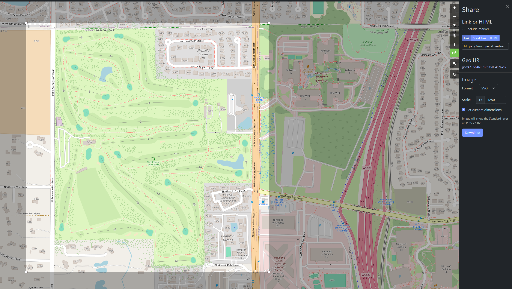
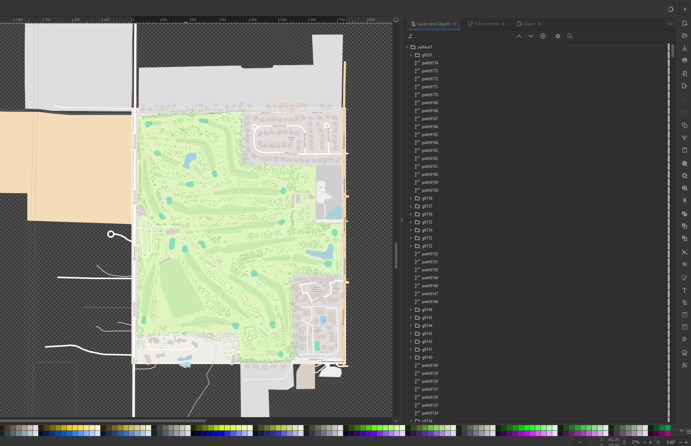
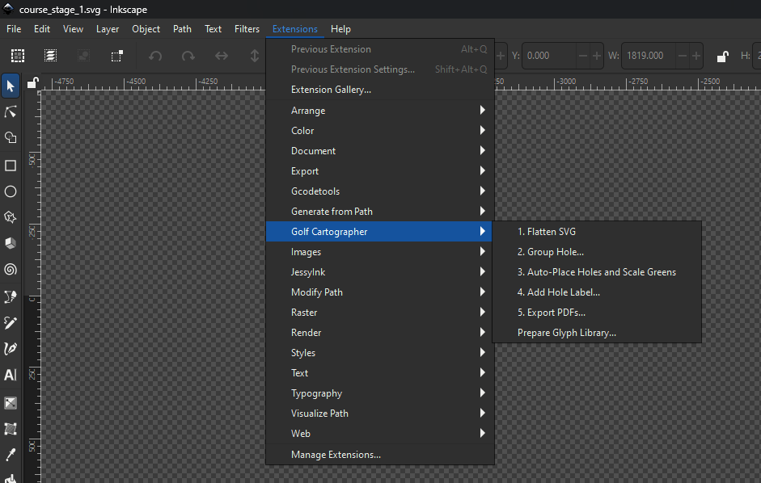
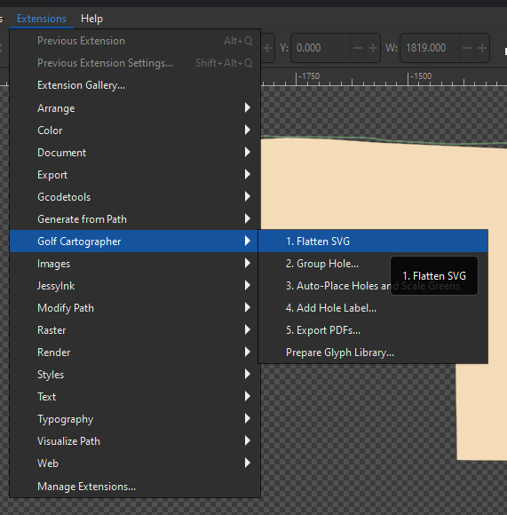
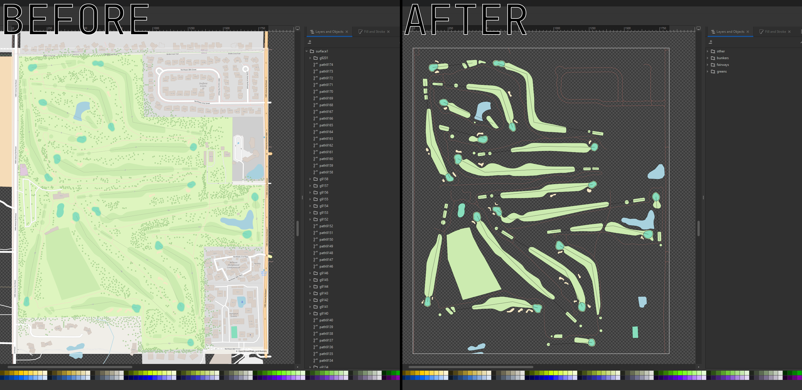
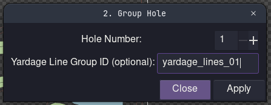
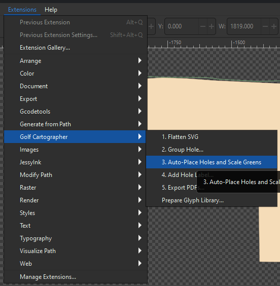
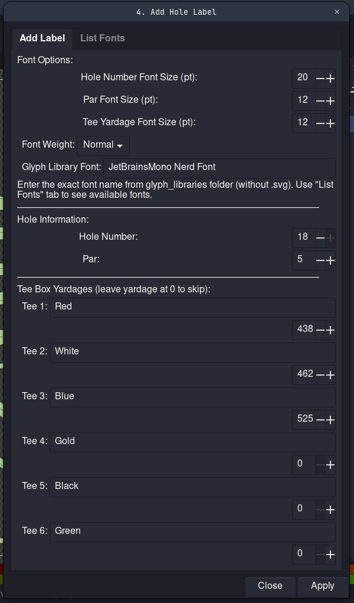
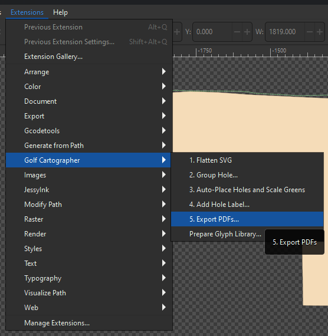

<!-- PROJECT SHIELDS -->
[](https://github.com/BitNinja01/golf-cartographer/graphs/contributors)
[](https://github.com/BitNinja01/golf-cartographer/network/members)
[](https://github.com/BitNinja01/golf-cartographer/stargazers)
[](https://github.com/BitNinja01/golf-cartographer/issues)
[](https://github.com/BitNinja01/golf-cartographer/blob/main/LICENSE)

---
<p align="center">
  
  
</p>

**Easily create golf yardage books for your favorite courses from OpenStreetMap data in Inkscape**

Golf Cartographer (GC) was born from my desire to optimize the time I was spending creating yardage books manually in Inkscape. No more hours of manual layer organization, positioning, and PDF arrangements. GC takes a previously 15-20 hour long process, and automates it into a ~1.5 hour process.

---

## What It Does

Golf Cartographer's core is a series of 5 Inkscape tools that automate a complete yardage book workflow:

1. **Flatten SVG** - Organizes a raw OSM SVG export into structured groups based on color.
2. **Group Hole** - Organize the elements of each hole into groups with terrain, greens, bunkers and paths/water. Run once for each hole.
3. **Auto-Place Holes** - Automagically positions holes and greens on the top and bottom pages. 
4. **Add Hole Label** - Adds hole numbers, par numbers, and tee box yardages to each page. Run once for each hole.
5. **Export PDFs** - Generates 20 print-ready PDFs in booklet format, and combines them into 5 saddle stitch ready PDFs.

Result: A complete yardage book ready for saddle-stitch printing, all from a single OSM export, and with minimal manual work.

---

## Requirements

- [**Inkscape 1.4.2 or later**](https://inkscape.org/) 
	- Required - earlier versions have incompatible APIs
- [**Python 3.7+**](https://www.python.org/downloads/)
	- This is bundled with modern Inkscape, so you shouldn't need to install it
- [**OpenStreetMap**](https://www.openstreetmap.org)
	- Locate your golf course on the map
	- On the right side of the page, find the "Share" tab
	- Set the "Format" to SVG
	- Set the "Scale" value as low as it will go
	- Use "Set custom dimensions" and draw a square around your course
	- Download the SVG
- The scorecard (with teebox yardages) of your golf course

**OSM website:**
<p align="center">
  
</p>

**SVG opened in Inkscape:**
<p align="center">
  
</p>
---

## Installation

1. Download the [latest GC release](https://github.com/BitNinja01/golf-cartographer/releases)
2. Unzip the downloaded file
3. **Locate your Inkscape extensions folder**:
	1. **Linux**: `~/.config/inkscape/extensions/`
	2. **macOS**: `~/Library/Application Support/org.inkscape.Inkscape/config/inkscape/extensions/`
	3. **Windows**: `%APPDATA%\inkscape\extensions\`
4. Copy the "golf-cartographer" folder into your inkscape extensions folder
5. **Verify**: Open Inkscape and check `Extensions > Golf Cartographer` - you should see 5 numbered tools and a glyph library tool.
<p align="center">
  
</p>

---

## Quick Start

#### Step 1: Flatten SVG
```
Extensions > Golf Cartographer > 1. Flatten SVG
```
<p align="center">
  
</p>
<p align="center">
  
</p>

1. Open the OSM SVG in Inkscape
2. Run the tool

This will strip out any "fluff" we don't need. A current limitation - the hole numbers will be caught in the cleaning process. I recommend keeping OSM open while you group the holes in Step 2.

After running, I recommend deleting any practice greens/driving range objects to make the document cleaner. If you want to keep them, they can be placed in the 'other' folder and they will be kept through the next steps of the process.

#### Step 2: Group Hole
```
Extensions > Golf Cartographer > 2. Group Hole
```
<p align="center">
  
</p>

1. (Optional) Prep the green yardage lines
	1. Import the ```template_yardage_lines.svg``` found in the downloaded ```templates``` folder
		1. This template represents 100, 125, and 150 yards from the center of each green. We need to scale it accordingly.
	2. Open [Google Earth](https://earth.google.com)
		1. Find you're golf course
		2. Find 2 elements that are roughly 100 yards apart (2 bunkers, a green and a bunker, etc)
		3. Place the center of the ```template_yardage_lines.svg``` at one of these points
		4. Scale it until the inner-most circle crosses your second reference point
		5. Once done, copy the name of this yardage lines group and then hide it
2. Run this tool once for each hole:
	1. Open the tool
	2. Select all elements belonging to that hole (fairway, green, and bunkers)
	3. Enter hole number (1-18) in dialog
	4. (Optional) Paste the yardage lines group name into this dialogue
	5. Run the tool

Takes ~3-8 seconds per hole. Each run creates a `hole_XX` group with terrain, green, and bunker elements organized separately. It will also place the yardage lines group at the center of the green, giving you a visual indicator of how far out you are from each hole while you play.

Save the resulting document as an SVG, we'll need it in the next step.

#### Step 3: Auto-Place Holes
```
Extensions > Golf Cartographer > 3. Auto-Place Holes
```
<p align="center">
  
</p>

1. Open ```tempate_yardage_book.svg``` from the GC templates folder
2. Import the SVG file we saved in Step 2
3. Run the tool

This will automatically:
- Position all 18 holes in the "top" area
- Rotate holes so that the greens are closest to the top of the page
- Extract and scale greens to fit inside the "bottom" grid

#### Step 4: Add Hole Label
```
Extensions > Golf Cartographer > 4. Add Hole Label
```
<p align="center">
  
</p>

1. Run this tool once for each hole
2. Enter:
   - Hole number
   - Par number
   - Tee box names and yardages (up to 6 tees)
3. Customize fonts if desired

Takes ~5-10 seconds per hole. Each adds a circle with the hole number, par number, and tee names/yardages. GC only comes packaged with the [JetBrians Mono](https://www.jetbrains.com/lp/mono/) font by default, but you can make your own glyph libraries using the [Prepare Glyph Library](#optional-prepare-glyph-library) tool that comes with GC.

If you're a nerd wondering why we need glyph libraries at all - Inkscape's Python API is kind of arcane, and doesn't like it when you run bounding box math on text objects. So yeah. Glyph libraries.

#### Step 5: Export PDFs
```
Extensions > Golf Cartographer > 5. Export PDFs
```
<p align="center">
  
</p>

Parameters:
- **Output Directory**: Where to save PDFs (default: Desktop)
- **Filename Prefix**: Prefix for all files (default: `yardage_book_`)
- **Combine into Booklets**: Enable saddle-stitch format (default: enabled)

Takes ~2-5 minutes total. Generates 20 PDFs:
- **Narrow PDFs** (4.25" × 14" each): 20 individual hole pages with strategic cross-pairing
- **Wide PDFs** (8.5" × 14" each): 10 pages with pairs side-by-side
- **Booklet PDFs** (5 files): Print-ready saddle-stitch booklets (2 pages each)

**Print Instructions**:
1. Print each booklet double-sided (flip on short edge)
2. Stack in order (booklet 5 outside, booklet 1 innermost)
3. Fold in half and staple along center

<!-- SCREENSHOT: HIGH - Booklet Assembly Diagram
     Show: Illustration showing physical assembly steps - 5 booklets stacked (05 outside), folding, stapling along center
     Why: Saddle-stitch printing instructions hard to visualize - reduces printing errors and wasted paper -->

#### Optional: Prepare Glyph Library
```
Extensions > Golf Cartographer > 0. Prepare Glyph Library
```

The glyph library tool prepares custom fonts for use in hole labels. Run this **before Stage 4** if you want to use fonts other than the packaged [JetBrains Mono](https://www.jetbrains.com/lp/mono/) font.

Use this before you run Add Hole Label. Only needs to be run once per font family.

**How to use**:
1. Run the tool from Extensions menu in a blank document
2. Enter the font family name (e.g., "Arial", "Times New Roman")
	1. If want to see the available ones, switch to the "Show Fonts" tab and hit "Apply". You can then copy the name of the font you want, and use it on the first tab of this tool.
3. Select the font style (Regular, Bold, Italic, Bold Italic)
4. Click Apply

The tool creates glyph paths that Stage 4 can reference. The Add Hole Label tool will use default system fonts if no valid glyph library is entered, which will work fine for most yardage books.

---

## Understanding the PDF Output

The 20 narrow PDFs are strategically paired for a complete 18-hole booklet:

| Page | Layout | Page | Layout |
|------|--------|------|--------|
| 1 | Hole 9 + Green 9 | 11 | Hole 10 + Green 8 |
| 2 | Hole 8 + Green 10 | 12 | Hole 11 + Green 7 |
| 3 | Hole 7 + Green 11 | 13 | Hole 12 + Green 6 |
| 4 | Hole 6 + Green 12 | 14 | Hole 13 + Green 5 |
| 5 | Hole 5 + Green 13 | 15 | Hole 14 + Green 4 |
| 6 | Hole 4 + Green 14 | 16 | Hole 15 + Green 3 |
| 7 | Hole 3 + Green 15 | 17 | Hole 16 + Green 2 |
| 8 | Hole 2 + Green 16 | 18 | Hole 17 + Green 1 |
| 9 | Hole 1 + Green 17 | 19 | Hole 18 + Notes |
| 10 | Scorecard + Green 18 | 20 | Back + Cover |

Each hole gets paired with a different hole's green (except for hole 9 since it's in the middle).

---

## Troubleshooting

### Extensions don't appear in menu
- Verify both `.py` and `.inx` files copied to extensions folder
- Restart Inkscape completely
- Check Inkscape version is 1.4.2+
### ImportError when running tool
- All utility files must be present: `transform_utils.py`, `geometry_utils.py`, `color_utils.py`
- Verify Python 3.7+ is available
### Color detection not working
- Check element colors match OSM palette
- Verify elements have fill or stroke colors set
- Manually adjust colors in Inkscape if needed, then retry
### Holes positioned incorrectly
- Ensure holes were properly grouped in Stage 2 with both terrain and greens
- Be sure to use the ```template_yardage_book.svg``` file when using these tools
### PDFs fail to export
- All holes must be named `hole_1` through `hole_18`
- Output directory must exist and be writable
- Check no holes are locked in Inkscape
- Verify Inkscape is accessible from command line (for PDF export)

---

## Contributing

Contributions welcome! Check [FUTURE_ENHANCEMENTS.md](docs/FUTURE_ENHANCEMENTS.md) for ideas or come up with your own :)

To contribute:
1. Add type hints and docstrings
2. Test manually in Inkscape
3. Submit PR with clear description and example input and output SVGs
